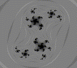

# CS241_Hearth
[Haiku Forth](http://forthsalon.appspot.com/) Interpreter written in Haskell. 

## Samples
  
  
  

## How it works
Hearth works by transcompiling Haiku Forth code into OpenGL Shading Language code, one operator at a time. 

## How to run
First, compile the program by running compile.cmd (on Windows systems).
Next, run the compiled program in one of the following ways:
 * HearthMain haikus/haiku_coffee.txt
 * HearthMain -c "x y t sin 2 / 0.5 +"
 
To view the translated GLSL code, pass in the "-v" argument.
